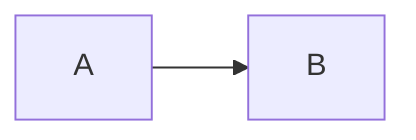

# Attribute list on a fence info string

Spec §Lexical grammar (family 4) and design 12 C28: the info string may end
with an attribute list in braces, parsed with the C1 value grammar. Its
classes and id have no bare spelling, so the printer keeps the braces when
there are any; plain `key=value` options stay bare words. On a `mermaid`
fence the options ride on the generated image.

## input

````md
```md {.snippet caption="A title" width="60%"}
# Hello
```



```python title=hanoi.py {.wide}
print(1)
```
````

## canonical

````md
```md {.snippet caption="A title" width="60%"}
# Hello
```


```python {.wide title="hanoi.py"}
print(1)
```
````

## ir

```json
{
  "blocks": [
    {
      "type": "CodeBlock",
      "text": "# Hello",
      "lang": "md",
      "options": {
        "classes": [
          "snippet"
        ],
        "kv": [
          [
            "caption",
            "A title"
          ],
          [
            "width",
            "60%"
          ]
        ]
      }
    },
    {
      "type": "Para",
      "content": [
        {
          "type": "Image",
          "attrs": {
            "kv": [
              [
                "generate",
                "mermaid"
              ],
              [
                "code",
                "flowchart LR\n  A --> B"
              ],
              [
                "width",
                "80%"
              ]
            ]
          }
        }
      ]
    },
    {
      "type": "CodeBlock",
      "text": "print(1)",
      "lang": "python",
      "options": {
        "classes": [
          "wide"
        ],
        "kv": [
          [
            "title",
            "hanoi.py"
          ]
        ]
      }
    }
  ]
}
```
