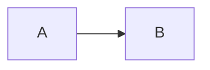

# Generated image

Spec §Image, Figure: `python image` executes and embeds; a bare `mermaid`
fence is an image, `mermaid code` a listing.

## input

```md
```python image include="plot.py"
plt.plot([1, 2, 4, 8])
```




```

## canonical

```md
```python image include="plot.py"
plt.plot([1, 2, 4, 8])
```


```

## ir

```json
{
  "blocks": [
    {
      "type": "Para",
      "content": [
        {
          "type": "Image",
          "attrs": {
            "kv": [
              [
                "generate",
                "python"
              ],
              [
                "code",
                "plt.plot([1, 2, 4, 8])"
              ],
              [
                "include",
                "plot.py"
              ]
            ]
          }
        }
      ]
    }
  ]
}
```
