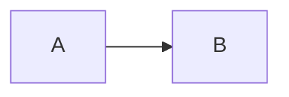

> Draft 3, consolidated specification proposal.
> Status: working draft. Normative wording ("MUST", "SHOULD") is aspirational
> until the conformance suite exists. Constructs marked *(proposed)* are not
> implemented in TeXSmith yet; everything else describes shipping behaviour.
> Draft 3 supersedes draft 2; the changes and their rationale are recorded in
> Appendix @[app:draft2], open questions in Appendix @[app:questions].

TMark is the Markdown dialect understood by TeXSmith. It is a curated,
opinionated stack: CommonMark structure, the Python-Markdown and PyMdownX
extension family that MkDocs users already know, and a small set of TeXSmith
constructs that close the gaps academic and technical writing actually has:
references, citations, numbering, captions, rich tables, and controlled
escape hatches to the backends.

Markdown was never designed for scientific documents. TMark does not try to
fix Markdown; it defines a *canonical subset with sugar*. Every feature has
exactly one canonical representation in the document model, and zero or more
sugar spellings that normalise to it. This is what makes linting, formatting
and round-tripping possible, and what keeps the syntax surface small even
though the feature list is long.

The specification is organised around the document model. §@[sec:model]
fixes the grammar families and the two sigils, §@[sec:conformance] the
conformance classes, §@[sec:front-matter] the front matter.
§@[sec:catalogue], the body of the spec, lists every node of the
intermediate representation with its canonical spelling, its accepted sugar,
its degradation class and its backend mapping. §@[sec:registries] describes
the registries the reference system draws on. Sugar that exists only for
compatibility with the PyMdownX world is confined to Appendix
@[app:pymdownx], and every deprecated spelling is dated in Appendix
@[app:deprecations].

This document is itself a TMark source, built with the TeXSmith that ships
today. Where the spec proposes a spelling that is not implemented yet (the
caption line after a table, the `:::` fence), the document uses the shipping
spelling instead, which the spec keeps as accepted sugar.

## Philosophy {#sec:philosophy}

Six principles drive every decision below. They are referred to as P1 to P6.

P1, content not form
:   The body carries meaning; templates, fragments and the `press` section of
    the front matter carry appearance. TMark deliberately has no body syntax
    for font, size, colour, borders or highlight stripes. One bold, one
    emphasis, one small caps, and a template decides what they look like.
    When a document needs a new *kind* of thing (a "Finding", a "Solution"
    callout), it declares the kind under `declare:` and uses it semantically
    in the body. What the kind looks like is declared under `press:` or in
    the template.

P2, canonical form plus permissive input
:   TMark accepts the common spellings of the Markdown jungle (GFM tables,
    PyMdownX admonitions, Pandoc caption lines and citations) but defines,
    for each feature, a single canonical form. A formatter (`tmark fmt`,
    roadmap) rewrites any accepted spelling to the canonical one. Sugar is
    for fingers; canonical is for tools.

P3, graceful degradation
:   A TMark file pasted into GitHub or any CommonMark renderer should stay
    readable. Every construct is classified (§@[sec:conformance]) by what a
    foreign renderer shows. Meaning changes are few, deliberate, and listed
    exhaustively.

P4, explicit over magic
:   No network fetches, no implicit content generation, no silent promotion
    of one construct into another unless the feature is named and switched
    on. Every such behaviour has an entry in the feature registry
    (§@[sec:features]) and an explicit canonical spelling that does not
    depend on the switch. Diagnostics are loud: an unresolved reference
    renders visibly as `[?key]`, never silently disappears.

P5, backend symmetry
:   Every construct must be expressible in LaTeX, Typst and HTML. A construct
    that only one backend can honour belongs in a raw passthrough, not in
    TMark proper.

P6, one mechanism per job, one spelling per mechanism
:   Where TeXSmith historically grew two spellings, two positions or two
    registries for one feature, this spec picks one and demotes the other to
    a compatibility alias with a deprecation horizon (Appendix
    @[app:deprecations]). No sugar is accepted without a horizon, and no
    horizon is later than the release that ships `tmark fmt`: a formatter
    that can rewrite a spelling removes the last reason to keep accepting it.

## Document model {#sec:model}

### The IR is the definition {#sec:ir}

A TMark document is front matter (YAML) plus a body. The body parses into a
typed intermediate representation (IR); backends render the IR. The IR, not
any concrete syntax, is the definition of TMark. The canonical serialization
of the IR back to TMark text is the *normal form*. `tmark fmt` (roadmap)
emits it, and round-tripping means `parse → IR → print → parse` is a fixed
point. §@[sec:catalogue] is therefore both the syntax reference and the
printer specification: for every node it states what the printer emits
(canonical) and what the parser additionally accepts (sugar).

### Round-trip and source spans {#sec:roundtrip}

"The IR is the definition" only means something if the IR can be turned
back into text. Three guarantees make it operational.

Normal form is a fixed point
:   `parse(print(ir))` equals `ir`, modulo source spans. The printer emits
    exactly one spelling per node (the "Canonical" column of
    §@[sec:catalogue]), so printing is deterministic and `tmark fmt` is
    idempotent: formatting a formatted document is a no-op.

Every node carries a source span
:   File, line, column and byte range of the text it was parsed from,
    including the sugar that produced it. Spans are what a backend needs to
    report a LaTeX or Typst error against the Markdown line that caused it
    (the LaTeX writer emits line markers, the HTML writer `data-src`
    attributes), what an editor needs for outline, hover and go-to-target,
    and what SyncTeX-style navigation from PDF to source is built on.

Edits are local
:   A tool that changes one node (rename a label, rewrite a citation, add
    an attribute) prints that node and splices it into its span. Every
    other byte of the file is untouched. This is how refactoring tools
    avoid a lossless concrete syntax tree: the IR stays an abstract tree,
    and locality plus spans give byte-identical round-trips for everything
    the tool did not touch.

What the canonical printer normalises, and therefore what a full reprint
loses: the choice of sugar, fence lengths and marker characters, attribute
order (`#id`, then `.class`, then keys in source order), redundant
whitespace, and the position of a caption line. What it never loses: soft
line breaks inside paragraphs (a `SoftBreak` is a node, so prose is not
re-wrapped and diffs stay minimal), comments (§@[sec:structure]), raw
passthroughs, escapes, and text that looked like syntax but was not
recognised (an unknown role name is `Str`, printed as typed). The front
matter is copied byte for byte: YAML comments and key order survive because
the printer does not re-serialise it.

Backends are one-directional. LaTeX or HTML output cannot be turned back
into the document that produced it, and the spec does not pretend
otherwise. The import direction is the HTML *reader*: a MkDocs page or a
foreign dialect enters as HTML, becomes IR, and the TMark printer writes it
in normal form. The printer is therefore just one more writer, and TMark
is one of its own backends.

### Four syntactic families {#sec:families}

Beyond core CommonMark structure (headings, paragraphs, lists, quotes,
emphasis, links, images, fenced code), TMark adds exactly four syntactic
families. Every construct in §@[sec:catalogue] is an instance of one of
them.

#### Attributes

Attributes decorate an existing node. They are written in braces *after*
the element they attach to:

```md
## Boot sequence {#sec:boot}
{width=60%}
```

Grammar: `{` followed by any number of `#id`, `.class`, `key=value` items
separated by spaces, then `}`. Values containing spaces are double-quoted.
There are no bare-word attributes: `{collapsed}` is not an attribute list
(write `{collapsed=true}`). This restriction is what makes attributes and
roles disjoint grammars (see below). Python-Markdown's `attr_list` puts a
colon right after the brace (`{: .thin #id}`); that spelling is accepted on
every host as sugar and deprecated (Appendix @[app:deprecations]), and the
printer drops the colon.

#### Roles

Roles create semantic inline nodes. The name comes *before* the content:

```md
{index}[endianness]   {aside}[see Prandtl 1921]   {raw latex}(\clearpage)   {include}(chapter.md)
```

Grammar: `{` name, an optional single positional argument, any number of
`key=value` arguments, `}`, immediately followed by the content in brackets
or the argument in parentheses. The name is a bare identifier
(`[A-Za-z][A-Za-z0-9_-]*`) drawn from the closed role registry of
§@[sec:catalogue]; an unknown name is literal text. The positional argument
is sugar for the role's principal key: `{aside left}` is
`{aside side=left}`, `{code py}` is `{code lang=py}`, `{raw latex}` is
`{raw backend=latex}`. There is no other micro-syntax inside a role head, in
particular no `name:arg` form.

Brackets and parentheses follow the rule Markdown links already apply in
`[content](argument)`: brackets hold *content*, parsed as Markdown and
reaching the reader; parentheses hold a verbatim *argument* the processor
consumes. `{aside}[see **Prandtl**]` and `{index}[…]` take content;
`{raw latex}(\textbf{x})`, `{include}(chapter.md)` and `{counter}(fw:x)`
take arguments, and nothing inside the parentheses is ever interpreted as
Markdown. Each role accepts one form or the other, never both; the `index`
role accepts several bracket groups, for nesting. Parentheses nest when
balanced, as in link destinations. The reader's intuition "brackets are
visible, parentheses are not" is a good approximation of the rule and the
reason for it.

Roles and attributes are disjoint by construction, not by heuristic. An
attribute list begins with `#`, `.` or `key=`; a role head begins with a bare
identifier. A parser decides after reading one token. The additional
requirement that a role head be immediately followed by `[` or `(` exists
only so that a brace group which is neither (`{foo}` in running text) stays
literal.

Attributes need a host. Headings, images, links, fenced blocks, tables and
caption lines are hosts; so is an anonymous span, written Pandoc-style as
`[text]{attrs}`. The span exists for attributes that are properties of a
piece of text rather than a new kind of node: an anchor on a phrase
(`[this claim]{#claim:one}`), the language of a quotation
(`[this taylor]{lang=en}`), or media restriction (`[web only]{media=web}`).
A span with no attributes is just brackets, as in CommonMark. An *empty*
link hugging an attribute list (`[](){#id}`, the MkDocs/autorefs anchor
idiom) is the same anchor written the long way: an empty link is no link,
so it reads as the span and is deprecated in favour of it (Appendix
@[app:deprecations]).

Three attributes are universal, accepted on every host:

`#id`
:   An anchor (§@[sec:references]).

`lang=`
:   The language of the element, for hyphenation, quotes and typographic
    spacing. The document default is the root `lang:` metadata key.

`media=`
:   Where the element is rendered: `all` (default), `print` or `web`. A
    word, a paragraph, a code block, a callout or a video restricted to one
    medium is the escape hatch of P5 when symmetry is impossible, and it
    replaces mirrored `latex raw` and `html raw` blocks. Nothing is
    conditional unless it says so.

Zero-width nodes (comments, index entries, anchors on their own, counter
definitions that print nothing, asides in the flow) take no space in the
text: whitespace on both sides collapses to a single space, and disappears
before punctuation. `Je suis un chien {aside}[remarque].` renders as
"Je suis un chien." with the aside attached to the preceding word. The
language's own punctuation spacing (the narrow no-break space before `:` in
French) is applied afterwards by the backend, not by this rule.

#### Container directives

Containers hold Markdown:

```md
::: figure {cols=2}
...markdown content...
:::
```

Grammar: `:::` name, an optional attribute list, content, closing `:::`.
Nesting is by fence length (`::::` outside `:::`), as in Pandoc and
markdown-it-container. `:::` is the canonical fence for every container
*(proposed; aligns with Pandoc, Djot, MyST, markdown-it-container)*. The
PyMdownX spellings `!!! type "Title"` and `??? type "Title"` remain accepted
sugar for callouts only, because MkDocs Material renders them natively
(§@[sec:containers]). The PyMdownX block fence `/// name … ///` is
deprecated (Appendix @[app:deprecations]).

#### Data directives

Data directives hold non-Markdown content in a fenced *code* block whose
info string is `<lang> <node>`. The second word names the IR node the fence
produces; it defaults to `code`, so an ordinary fenced code block is the
degenerate case of the family. The same Python source is a listing or a
figure depending on that one word:

````md
```python
import matplotlib.pyplot as plt          # a CodeBlock: shown as a listing
plt.plot([1, 2, 4, 8])
```

```python image
import matplotlib.pyplot as plt          # an Image: executed, output embedded
plt.plot([1, 2, 4, 8])
plt.savefig("out.pdf")
```

```yaml table
columns: [A, B]                          # a Table
rows: [[1, 2]]
```
````

Node words: `code` (default), `table`, `table-config`, `image`, `raw`.
`yaml table`, `grid table`, `python image`, `mermaid image`, `latex raw` are
the instances this spec defines. The word names the node produced, never an
action (`render`, `exec`). One language has a different default: a bare
`mermaid` fence produces an image, because that is what MkDocs Material and
every Mermaid-aware renderer do with it; `mermaid code` restores the listing.
Degradation is excellent: any other renderer shows a plain code block.

The split between containers and data directives is a rule, not an accident:
containers hold Markdown, fences hold data. A figure group is a container; a
table description, a diagram source or a raw LaTeX payload is data.

Headings, lists and paragraphs are *not* re-expressible as roles or
directives. CommonMark structure is the substrate; the four families extend
it. (MyST and reST make the same choice: nobody writes headings as
directives.)

### Two sigils {#sec:sigils}

TMark reserves two inline sigils, each with exactly one meaning and exactly
two bracketings (Table @[tbl:sigils]).

Table: The two sigils and their bracketings. {#tbl:sigils}

| Sigil | Meaning | In braces (attribute) | Before brackets (node) |
| ----- | ------- | --------------------- | ---------------------- |
| `#`   | define | `{#id}` names an existing host element | `#[term]` creates an index entry (content), `#(fw:key)` a counter item (argument) |
| `@`   | refer  | (none) | `@key` bare, `@[key …]` bracketed |

"`#` defines, `@` refers" is the mnemonic the whole reference system hangs
on. The forms are not redundant: an attribute needs a host element (a heading,
an image, a caption line, a span), whereas an index entry or a numbered
finding in a table cell has none. Among the standalone forms, the bracket
rule of §@[sec:families] does the routing: an index term is content
(`#[byte order]`), a counter key is an argument (`#(fw:boot-loop)`), so the
parser never has to consult a registry to tell them apart. `#{…}` (draft
2's counter marker) is withdrawn; `#(…)` replaces it with one character
changed and a rule behind it.

`^` is no longer a sigil. It appears in `[^1]` (footnote, CommonMark
convention) and `^x^` (superscript, PyMdownX convention) with unrelated
meanings; pretending it means "note" made the table lie.

### Registries {#sec:lookup}

`@` and `#[…]` resolve against named registries (§@[sec:registries]). A
reference `@a:b` whose head `a` is a declared counter prefix is a label or
counter reference; `@gls:term` is a glossary reference; any other `@key` is
a bibliography key. `#(fw:boot-loop)` is routed by its prefix to a
declared counter and warns when the prefix is unknown. Resolution of `@` is
a registry lookup, not a spelling: the prefix table in §@[sec:counters] is
the single source of truth.

### Lexical grammar {#sec:grammar}

The patterns below are the normative recognisers for the four families and
the two sigils, as PCRE. They are what an editor grammar or a linter needs;
the prose in the rest of the spec explains them. Named groups are the
fields the IR receives.

Attribute list (family 1), after a host element, on its line or at end of
line:

```text
\{(?:\s*(?:#(?<id>[\w:.-]+)|\.(?<class>[\w-]+)|(?<key>[\w-]+)=(?<value>"(?:[^"\\]|\\.)*"|\S+)))+\s*\}
```

Inside a quoted value `\"` stands for a quote and `\\` for a backslash;
any other backslash is literal. A bare value ends at whitespace or `}`. The
deprecated Python-Markdown form is the same pattern with `\{:?` in place of
`\{`.

Role (family 2); the head must be followed immediately by bracketed
content (one group, or several for `index`) or by a parenthesised verbatim
argument (balanced parentheses allowed inside):

```text
\{(?<name>[A-Za-z][\w-]*)(?:\s+(?<positional>[^\s=}]+))?(?:\s+(?<key>[\w-]+)=(?<value>"(?:[^"\\]|\\.)*"|\S+))*\}
(?:(?:\[(?<content>(?:[^\[\]\\]|\\.)*)\])+|\((?<argument>(?:[^()]|\((?&argument)\))*)\))
```

Anonymous span, a host for attributes only:

```text
\[(?<text>(?:[^\[\]\\]|\\.)+)\](?=\{)
```

The two grammars are disjoint: after the opening brace an attribute list
continues with `#`, `.` or `key=`, a role head with a bare identifier.

Container fence (family 3), opening and closing lines:

```text
^(?<fence>:{3,})\s*(?<name>[A-Za-z][\w-]*)(?:\s+(?<attrs>\{[^}]*\}))?\s*$
^(?<fence>:{3,})\s*$
```

A dotted name is not a container but a foreign directive
(§@[sec:structure]); it has no closing line and its body is the indented
lines that follow:

```text
^:{3,}\s*(?<directive>[A-Za-z][\w-]*(?:\.[\w-]+)+)\s*$
```

Data directive info string (family 4), on the opening code fence:

```text
^(?<lang>[\w+-]+)(?:\s+(?<node>code|table|table-config|image|raw))?(?<attrs>(?:\s+[\w-]+=(?:"(?:[^"\\]|\\.)*"|\S+))*)\s*$
```

Bare reference or citation (`@` refers). The look-behind is the X4 guard:
no `@` inside a word, an e-mail address or a URL; the key must end on an
alphanumeric so sentence punctuation stays out:

```text
(?<![\w@/:.-])@(?<key>[A-Za-z][\w:.-]*[A-Za-z0-9])
```

Bracketed reference or citation, required as soon as the reference
contains a space. One or more items separated by `;`, each with optional
prefix text, an optional `-` (suppress author), the key, and optional suffix
or locator text (Pandoc's item grammar):

```text
(?<![\w@/:.-])@\[(?<item>[^\[\];]*?-?(?<key>[A-Za-z][\w:.-]*[A-Za-z0-9])[^\[\];]*)(?:;(?&item))*\]
```

Standalone definitions (`#` defines): an index entry with one to three
bracket groups, a counter item with one parenthesised key; `\#` escapes:

```text
(?<!\\)#\[(?<term>[^\[\]]+)\](?:\[(?<sub>[^\[\]]+)\]){0,2}
(?<!\\)#\((?<prefix>[A-Za-z][\w-]*):(?<key>[\w.-]+)\)
```

Caption line, a paragraph of its own adjacent to the float:

```text
^(?<kind>Table|Figure|Listing):\s+(?<text>.*?)(?:\s*\{#(?<id>[\w:.-]+)\})?\s*$
```

Escapes: `\@`, `\#`, and any backslash-escaped bracket inside role content.
Inside code spans and fenced blocks none of the patterns fire.

## Conformance and deviations {#sec:conformance}

Every construct carries a degradation class, which says what a renderer
other than TeXSmith shows for the same bytes.

C, compatible
:   Renders identically in CommonMark and GFM.

E, extension-compatible
:   Not CommonMark, but renders identically under the standard extension set
    of Table @[tbl:extensions], which is what MkDocs, MkDocs Material, Zensical
    and any Python-Markdown site already load. The extensions in that set are
    mutually compatible and TMark never redefines what they do.

D, degrades
:   Foreign renderers show something readable but unstyled: a code block, a
    literal `!!! note` line, a `Table:` paragraph.

X, diverges
:   The same bytes *mean something else* in GFM. These are the dangerous
    ones; Table @[tbl:deviations] is exhaustive and normative.

Table: The standard extension set that defines class E. {#tbl:extensions}

| Package | Extensions | Constructs |
| ------- | ---------- | ---------- |
| Python-Markdown | `extra` (`abbr`, `attr_list`, `def_list`, `fenced_code`, `footnotes`, `md_in_html`, `tables`), `admonition`, `toc` | acronyms, attributes, definition lists, footnotes, pipe tables, `!!!` callouts, `<div markdown>`, `[TOC]` |
| PyMdownX | `superfences`, `highlight`, `inlinehilite`, `snippets`, `arithmatex` | nested fences, code options, `#!lang` inline code, includes, math |
| PyMdownX | `caret`, `tilde`, `mark`, `keys`, `betterem`, `smartsymbols`, `emoji`, `magiclink`, `critic` | `^x^`, `~x~`, `==x==`, `++ctrl+s++`, smart symbols, emoji, bare URLs, critic markup |
| PyMdownX | `details`, `tasklist`, `fancylists`, `progressbar`, `tabbed` | `???` callouts, task items, list markers, progress bars, tabs |

Table: Class X deviations from GFM. {#tbl:deviations}

| # | Syntax | GFM meaning | TMark meaning | Rationale |
| - | ------ | ----------- | ------------- | --------- |
| X1 | `__text__` | bold | small caps | `__` duplicates `**`; academic writing needs small caps far more than a second bold. Visible, not silent: small caps look nothing like bold. Disabled by the `strict` profile. |
| X2 | `---` (thematic break) | horizontal rule | page break (paged media) | See §@[sec:structure]. Semantically it stays a divider; the paged writers emit `\tsdivider` / `#ts-divider()`, a page break unless the template redefines it; the web shows `<hr>`. Disabled by the `strict` profile. |
| X3 | `~x~` | strikethrough (single tilde) | subscript | PyMdownX tilde, long-established in the MkDocs world; the only class-E construct GFM assigns a different meaning to. |
| X4 | `@word` | literal | reference or citation | Guarded: never fires inside e-mails, URLs, or code; `\@` escapes. Identical to Pandoc's behaviour with `--citeproc`. |
| X5 | `#[…]`, `#(…)` | literal | index entry, counter item | `#[` or `#(` followed by a non-space never occurs in prose; `\#` escapes. No further guard is needed now that `#{…}` is gone. |

A conformant TMark processor MUST implement classes C, E and D and MUST
document which X-deviations are active.

Profiles *(proposed)* select which deviations and which sugar are active.
`default` accepts everything in this document and Appendix @[app:pymdownx].
`strict` disables X1 and X2 and rejects Appendix @[app:pymdownx] sugar, for
teams that co-render sources on GitHub. `tmark fmt` translates between
profiles; the translation is lossless because every sugar has a canonical
form that is class C, E or D.

## Front matter {#sec:front-matter}

YAML island at line 1, fenced by `---`.

`press` is a namespace, not a category. Every key TMark reads (`template`,
`base_level`, `declare`, `sources`, `features`, and the metadata keys
`title`, `authors`, `date`) may sit at the root of the front matter or under
`press:`; when the same key appears in both places, `press` wins. The
namespace is optional and exists for one reason: a Markdown file is often
shared with a static site generator whose own front matter schema owns the
root (MkDocs, Hugo, Jekyll, Zensical). Moving the TMark keys under `press`
keeps them out of that generator's way without changing their meaning. A
document that only TeXSmith reads may put everything at the root.

Within the namespace, four groups *(proposed layout; the draft-2 top-level
keys remain accepted with a deprecation warning, Appendix
@[app:deprecations])*:

```yaml
---
# Document metadata stays at the root: every other tool (MkDocs, Pandoc,
# editors) reads `title` and `date` there.
title: Firmware Review          # omitted → first heading is promoted
authors: [{name: Ada Lovelace, affiliation: Analytical Engine}]
date: 2025-03-15                # ISO date | string | "commit"
id: RHE-423                     # document identifier for cross-doc references
epigraph: {quote: …, source: …}

press:                          # optional namespace; every key below may sit at the root
  template: book                # form: article | book | letter | user template
  base_level: chapter           # what a top-level `#` maps to
  callouts:
    style: fancy                # fancy | classic | minimal
    solution: {icon: "🎓", color: "#123456"}   # styling of a declared kind
  details: expand               # expand | reference
  code: {engine: pygments, inline: {breaks: true}}
  slots: {abstract: Abstract}

  declare:                      # kinds: what things *are*
    counters: {…}
    admonitions: {…}
    glossary: {…}
    acronyms: {…}

  sources:                      # where references resolve
    bibliography: {…}
    crossrefs: {…}

  features:                     # the switch registry
    figures.exec: true
---
```

The groups are P1 applied to the front matter itself. `declare` says that a
"Solution" callout exists, belongs to the group "Solutions" and is referred
to as "See page N"; the form keys (`template`, `callouts`, `code`, …) say it
is blue with a graduation-cap icon. A document can be re-skinned by
replacing the form keys alone.

All sections are validated (pydantic); unknown keys fail at parse time, not
in the PDF.

Any front-matter value is available in the body as a moustache, `{{ key }}`
or `{{ press.template }}`, resolved after Markdown parsing and never inside
code spans or fenced blocks. This ships today. An unresolved moustache
warns and is left in place, visibly. Moustaches are substitution, not
templating: there is no logic, no loop, no filter, and the spec does not
intend to add any; a document that needs computation generates its
Markdown. Class C: a foreign renderer shows the moustache as typed.

The root `lang:` key (`fr`, `en-GB`, …) is the document language, used for
hyphenation, quotes, list-of-figures words and typographic spacing. Spacing
rules are applied by the backend from the language: the narrow no-break
space before `;`, `:`, `?`, `!` in French, the no-break space between a
number and a unit, and never by a construct in the body. `&nbsp;` is
accepted as an explicit override, class C. A passage in another language
is a span: `[this taylor]{lang=en}`.

## Node catalogue {#sec:catalogue}

Each entry follows the same shape: the canonical spelling (what `tmark fmt`
emits), the sugar the parser additionally accepts (each with its status in
Appendix @[app:deprecations]), the degradation class, and the backend mapping
(LaTeX, Typst, HTML). Node names are those of `texsmith.ir.nodes`; nodes
marked *(proposed)* do not exist yet.

### Structure {#sec:structure}

#### Header

`#` to `######`, six levels, never manually numbered. Attributes at end of
line: `## Title {#sec:intro}`. Class C. Headings are relative: TeXSmith
aligns messy multi-file hierarchies automatically (per-fragment offset from
the shallowest heading, plus the template slot base, plus
`press.base_level`), and promotes the first heading to the document title
unless `title:` is declared (`title: null` or `--no-promote-title` opt out).
That machinery is a processing concern, not syntax. Backends: `\section` and
friends, `= Heading`, `<h1>`.

Two classes are recognised on a heading, both Pandoc's: `.unnumbered` takes
the heading out of the numbering sequence (`\section*`, `numbering: none`,
`class="unnumbered"`), and `.unlisted` additionally keeps it out of the
table of contents. Each applies to its own heading only; the document-level
default is `press.numbered` (`true` by default), which a class overrides one
heading at a time. Pandoc's `{-}` shorthand is not an attribute list (there
are no bare-word attributes, §@[sec:families]) and stays literal text; the
Pandoc importer rewrites it. Class E.

A heading with no `{#id}` has an *implicit id*, so that the empty-link and
textual forms of §@[sec:references] (`[](#boot-sequence)`,
`[the boot sequence](#boot-sequence)`) resolve to it, as they do on GitHub
and on every Python-Markdown site. The rule is GitHub's: the plain text of
the heading (inline markup and code reduced to their text, zero-width nodes
and the attribute list removed), NFC-normalised and lower-cased, every
character that is not a letter, a digit, a combining mark, a space, `-` or
`_` removed, runs of spaces turned into one `-`; a duplicate gets `-1`,
`-2`, … in document order. Accents and non-Latin scripts survive, as on
GitHub and MkDocs Material; a site whose slugifier differs (Python-Markdown's
default `toc` drops accents) needs an explicit id, which is the
recommendation anyway. The implicit id is a label like any other
(`@boot-sequence` renders "section 2"), derived at resolution and never
stored in the IR or printed, so the round-trip is untouched; an explicit
`{#id}` replaces it, a heading having one id. Because an implicit id
changes whenever the title is edited, a reference to one is a lint hint
`ref-implicit-id` that suggests `{#id}`. Editors compute go-to-target with
the same function.

#### Para

CommonMark. A *lead-in* paragraph (a short run-in heading that opens a
paragraph) has an explicit role:

```md
{lead}[Boot sequence.] The device powers the flash before the SoC…
```

The role takes what follows it on the paragraph, whatever that is: the
lead-in is what the author wrote between the brackets.

Sugar: a paragraph whose *whole* content is a strong span shorter than 80
characters is promoted to a lead-in when feature `paragraph.lead` is on (on
by default, off under `strict`). A strong span that merely opens a
paragraph is a bold run-in and stays one — promoting it would move the rest
of the sentence into a paragraph of its own, since `\tslead` breaks the
paragraph around the lead-in. A list item is not promoted either: a
bold-only item is a label. The promotion is sugar, not magic: it is
named, switchable, and `tmark fmt` rewrites it to the role. Class C.
Backends: `\tslead{…}`, a bold run-in, `<p><b class="lead">`.

#### BlockQuote

`>`; class C. A quote tagged `{.epigraph}` renders as an epigraph; the
front-matter `epigraph:` key places one before the first heading.

#### BulletList, OrderedList

`-` and `1.`, nesting by indentation; `pymdownx.fancylists` markers are
accepted (Appendix @[app:pymdownx]). Task items `- [ ]` and `- [x]` are
class C; `- [.]` "partial" *(proposed)* is class D, feature
`tasklist.partial`, off by default.

#### DefinitionList

PHP-Markdown-Extra `def_list`, class E:

```md
Term
:   Definition, indented continuation lines aligned.
```

#### Comment

```md
<!-- Inline note to self, never rendered. -->

<!--
A block comment: alone on its lines, it is a block node.
-->
```

Canonical and only spelling: the HTML comment, inline or block. A comment
is a node, not something the parser drops: the printer re-emits it in
place, so `tmark fmt` never loses an author's note. The rendering default
is to strip it in every backend, with `press.comments: keep` emitting `%`
lines in LaTeX, `//` in Typst and an HTML comment on the web for debugging
builds. A comment has zero width in the flow: whitespace on both sides
collapses to one space and disappears before punctuation.

No other spelling qualifies, and the reason is P3 read strictly. The
degradation of a comment must be invisibility, and the HTML comment is the
one construct every Markdown renderer hides. A `::: comment` container or a
`{comment}(…)` role would display its content on GitHub, which for a
private note is worse than any unstyled fallback. Critic's `{>>note<<}`
normalises to this node (Appendix @[app:pymdownx]). Annotations meant to be
read by reviewers in a draft build (to-dos, change tracking) are not
comments: they are visible content in one rendering mode and belong to a
separate node. Class C.

#### HorizontalRule

`---` on its own line, blank lines around, is a *divider* node
(`HorizontalRule`). The syntax keeps its CommonMark semantics ("section
divider"); what a divider looks like is form, so no writer chooses it
itself: the LaTeX writer emits `\tsdivider`, the Typst writer
`#ts-divider()`, and the `ts-typesetting` fragment defines both as a page
break (`\clearpage`, `#pagebreak()`), which a template redefines at will (a
fleuron, a blank line, nothing). The HTML writer emits `<hr>`: the web shows
a rule and never a page break. The paged default is the one opinionated
part (X2). There is no line-break role: Markdown's hard break (trailing
`\`) exists, and a backend-specific break is a raw passthrough:
`{raw latex}(\newpage)`.

#### Foreign directive

Two spellings of the MkDocs world are directives for a processor other than
TMark: Python-Markdown's `[TOC]` paragraph, and a `:::` line whose name is
dotted (`::: texsmith.core.config`, mkdocstrings' syntax, its options in the
indented YAML that follows, no closing fence). TMark interprets neither:
each is a `RawBlock` with `format=markdown`, kept verbatim. The `[TOC]` form
is the paragraph alone; the dotted form is the `:::` line plus every
following line that is blank or indented by four spaces or more, so the
directive closes at the first dedent, and the fence rules of
§@[sec:families] (matching `:::`, `container-unknown`, `container-unclosed`)
do not apply to it. The printer emits the block as typed; the HTML writer
and the paged writers emit nothing: the table of contents in print is
`press.toc`, and an API reference has no print form. `[TOC]` is silent
(class E); a dotted directive is a hint `directive-foreign` in every
backend but the printer, so that a document meant for print does not lose a
block without notice (class D).

### Inline text {#sec:inline}

Table @[tbl:inline] lists the inline nodes, their canonical spelling, their
sugar and their mapping.

Table: Inline text nodes. {#tbl:inline}

| Node | Canonical | Sugar | Class | LaTeX / Typst / HTML |
| ---- | --------- | ----- | ----- | -------------------- |
| `Emph` | `*x*` | `_x_` | C | `\emph` / `_x_` / `<em>` |
| `Strong` | `**x**` | (none) | C | `\textbf` / `*x*` / `<strong>` |
| `SmallCaps` | `{sc}[x]` | `__x__` (X1) | X | `\textsc` / `smallcaps` / `font-variant` |
| `Strikeout` | `{del}[x]` | `~~x~~` | C | `\sout` / `strike` / `<del>` |
| `Underline` | `{underline}[x]` | `^^x^^` under `inline.insert` only | D | `\underline` / `underline` / `<u>` |
| `Highlight` | `{mark}[x]` | `==x==` | E | `\hl` / `highlight` / `<mark>` |
| `Subscript` | `{sub}[x]` | `~x~` (X3) | X | `\textsubscript` / `sub` / `<sub>` |
| `Superscript` | `{sup}[x]` | `^x^` | E | `\textsuperscript` / `super` / `<sup>` |
| `Keystroke` | `{keys}[ctrl+s]` | `++ctrl+s++` | E | ts-keystrokes / `kbd` / `<kbd>` |
| `Code` | `` `x` `` | (none) | C | engine-dependent |
| `Code` (highlighted) | `{code lang=py}[print(1)]`, positional `{code py}[…]` | `` `#!py print(1)` `` | E | engine-dependent |
| `Quoted` | `"x"`, `'x'` | SmartyPants (Appendix @[app:pymdownx]) | C | locale quotes |
| `Span` | `[x]{attrs}` | (none) | D | `\foreignlanguage`, anchor, media switch |

```yaml table-config
columns:
  - {width: 2.1cm}
  - {align: left, width: X}
  - {align: left, width: X}
  - {width: 1cm}
  - {align: left, width: X}
```

Underline has a role and no sugar, and the obvious sugar, `__x__`, goes to
small caps instead. The case for underline is visual: two underscores look
like an underline. The case for small caps is frequency and typography.
Academic and technical prose uses small caps constantly (author names in
citations, acronyms set as small caps, keywords in definitions) and
underline almost never: print typography treats it as a typewriter relic,
and every style guide recommends emphasis or small caps in its place. The
one construct that deserves a two-keystroke spelling is the frequent one.
Giving `__` to underline would also lower the cost of a construct the spec
does not want to encourage. The visual argument is real but it is the same
argument that gave Markdown `*` for emphasis, which does not look like
italics either. Draft 1 assigned `__` to underline; draft 2 reversed it to
match the shipping implementation and the reasoning above. `^^x^^` (caret "insert") is not a TMark
construct: with the feature `inline.insert` off (the default) it is literal
text and `tmark lint` hints `feature-off`; on, it is sugar for
`{underline}[x]`, one node whatever the spelling, and the printer emits the
role (Appendix @[app:pymdownx]). Long inline code wraps per
`press.code.inline`.

#### Math (inline)

`$…$` canonical; `\(…\)` accepted as a compatibility layer (LaTeX habit,
class E under `arithmatex`, literal elsewhere). Content is LaTeX math
(MathJax-compatible), the Typst backend translates it. No space directly
after the opening delimiter. Class C for `$…$`: GitHub renders it natively.

#### ProgressBar

```md
[=45% "Review"]
[=100% "Launch"]{.thin}
```

An inline node with a `value` (a number from 0 to 100, clamped) and an
optional `label` (plain text in double quotes; the percentage when absent).
Attributes attach as on any host: `.thin` halves the height; other classes
reach the web stylesheet and are ignored in print. The spelling is
PyMdownX's and is the canonical one. Sugar: the fraction form
`[=9/20 "Review"]`, normalised to a percentage, and the Python-Markdown
attribute spelling `{: .thin}` (both deprecated, Appendix
@[app:deprecations]). PyMdownX registers the pattern inline and its
stylesheet displays the bar as a block; TMark keeps the node inline
(a bar fits a table cell), consecutive bars on separate lines are separate
paragraphs or hard-broken lines, and the template chooses the width. Class
E. Backends: `\tsprogress` (`ts-typesetting`, over the `progressbar`
package), `#ts-progress`, `<div class="progress">`. Recogniser:

```text
\[=\s*(?<value>\d+(?:\.\d+)?)%(?:\s+"(?<label>[^"]*)")?\s*\]
```

#### Emoji and icon shortcodes

An emoji shortcode `:smile:` is sugar for the character it names: the
tokenizer replaces it with a `Str` holding U+1F604, and the printer emits
the character. The name table is GitHub's (the `gemoji` short names, which
`pymdownx.emoji` ships as one of its indexes): a colon-delimited word that
is not in the table is literal text with no diagnostic, so `12:30:45` and
`a:b:c` are safe. Nothing fires in code. Class E, and GitHub renders the
shortcodes too. How an emoji is set in print (a colour font, a monochrome
one, an image) is the template's business, not syntax.

An icon shortcode (`:material-cog:`, `:fontawesome-solid-check:`,
`:octicons-tag-16:`, `:simple-github:`) names an SVG of the MkDocs Material
theme, which no print backend and no icon-less site can honour (P5). It is
recognised by those four set prefixes and lowers to a web-only span,
`Span{.icon media=web}` holding the shortcode as its text, so the media rule
of §@[sec:families] removes it from print (the spaces around it collapse)
and the HTML writer emits `<span class="icon">:material-cog:</span>` for the
site's stylesheet or plugin to replace. The shortcode is its own canonical
spelling: the printer writes such a span back as the shortcode. `tmark
lint` hints `icon-web-only` once per shortcode, so an author writing for
print knows the icon is not there. Class D. Icons are decoration; a symbol
that must reach print is an emoji or an image.

#### TeX logos

`TeX`, `LaTeX`, `LaTeX2e`, `XeTeX`, `XeLaTeX`, `LuaTeX`, `LuaLaTeX`,
`pdfTeX`, `pdfLaTeX`, `BibTeX`, `BibLaTeX` and `ConTeXt`, written as plain
words, are set as logos by the backends (`\LaTeX{}` and the
`ts-typesetting` logo macros, a Typst function, `<span class="tex-logo">`
with the raised and lowered letters). There is no node and no role: the
words are `Str` in the IR and print as typed. Like the language-driven
punctuation spacing of §@[sec:front-matter], the logo is a typographic
rule applied by the writer, form rather than content (P1). The rule is the
feature `typography.tex-logos`, on by default (shipping behaviour): it
matches whole words only, case-sensitively, and never inside code, math,
raw passthroughs, link destinations or attribute values. To print one of
these words literally, turn the feature off or put the word in a code span;
there is no per-word opt-out, on purpose.

### Notes {#sec:notes}

#### Note (footnote)

`[^1]` reference, `[^1]: text` definition; class C (GFM) and E. Footnotes
should stay one line in print. Inline footnotes `^[text]` *(proposed,
Pandoc)* become available once the citation sugar that occupied that
spelling is retired (Appendix @[app:deprecations]).

#### Aside (`MarginNote`)

Inline role for a remark tangential to the flow:

```md
Hooke's law {aside}[linear only at small strain] holds below the yield point,
but non-linear effects {aside side=left}[see **Prandtl 1921**] dominate above it.
```

The node is named for what it is, not where it goes (P1): the print
templates put asides in the margin, a web template may render a sidebar or
a collapsed note. `side=left|right|outer|inner` is a layout hint of the
same standing as `width=` on an image, with the default in `press.aside`.
The aside has zero width in the flow (§@[sec:families]), so the spaces
around it collapse. Sugar: `{margin}[…]` and the shipping suffix
`{margin}[…]{l}` (deprecated, Appendix @[app:deprecations]). Block form for
longer asides is a container:

```md
::: aside
A **marginal note** attached to the preceding paragraph.
:::
```

Class D. Backends: `\marginnote`, `place(…)`, `<aside>`. Width, font-size
clamping and geometry awareness are the `ts-extra` fragment's problem, not
syntax. The IR node keeps its shipping name `MarginNote`.

### Anchors, references, citations {#sec:references}

#### Anchor (attribute)

Not a node. Any element takes an id through attributes: `## Title
{#sec:intro}`, `{#fig:trace}`, `$$ … $$ {#eq:x}`, a caption
line (§@[sec:floats]), a span (`[this claim]{#claim:one}`). Where a block
has a caption line, the anchor lives on the caption line; otherwise on the
element. One rule, no second place.

The host decides the counter, not the prefix. A heading is a section, a
`Table:` line is a table, an image is a figure: `Table: Stock {#stock}`
registers `stock` with the table counter and `@stock` renders "table 3".
The prefixed spelling `{#tbl:stock}` remains the recommended convention,
because pandoc-crossref requires it, because it keeps `fig:trace` and
`tbl:trace` apart, and because a reference reads better when its kind is in
the key; when a prefix is present it must agree with the host, and a
mismatch is linted. A prefix is *required* only where no host tells the
kind: counter items (`#(fw:x)`), and an explicit prefix on a heading or
image to number it in a custom series instead of its own
(`## Boot loop {#fw:boot-loop}`).

#### Ref

*(Proposed as a distinct node; today a `Link`.)* `@` refers. TMark adopts
Pandoc's citation grammar for labels and bibliography keys alike:

```md
@sec:intro                          bare, in-text: "section 2"
@Sec:intro                          capitalised prefix → "Section 2" (sentence start)
@[fig:boot; fig:crash]              bracketed: grouped → "figures 1 and 2"
@[tbl:stock, column 3]              bracketed with a suffix → "table 4, column 3"
[](#sec:intro)                      empty-link form, class C, for pure-Markdown toolchains
[](other.md)                        section number of another document's main heading
```

The brackets are optional and follow the sigil. Bare `@key` takes one word
of `[A-Za-z0-9_:.-]`; trailing sentence punctuation stays out. The bracketed
form `@[…]` is required as soon as the reference contains a space: a
locator, a suffix, or several keys separated by `;`. Inside the brackets the
item grammar is Pandoc's: optional prefix text, optional `-`, the key,
optional suffix or locator. A capitalised prefix (`@Fig:x`) capitalises the
label word (pandoc-crossref convention); prefixes are otherwise
case-insensitive. Sugar: Pandoc's own `[@key, locator; @key2]`, accepted for
import and never emitted.

A numeric reference renders the counter's `ref` template
(§@[sec:counters]): "Figure 3", "figure 3", "Abbildung 3", "FW-01", as a
hyperlink, identically in every medium. Unresolved: `[?key]` visibly, plus
a warning. `\@` forces a literal `@`; e-mails and URLs never match (X4).
Class X.

A *textual* reference lets the author write the prose and keeps the
number out of the body:

```md
As [the trace](#fig:trace) shows, the watchdog fires twice.
```

Canonical form: a link with text to the anchor (class C). On the web the
text is the link and nothing is added. In paged media a hyperlink is not
enough, so the template appends a locator whose shape is form, hence
declared in `press`, per medium:

```yaml
press:
  refs:
    textual:
      print: "{text} ({number})"        # "the trace (3)"; or "{text} (p. {page})", or "{text}"
      web: "{text}"
```

`{page}` is a field of paged media only; it never appears in the body, so
the author never has to know the backend or the pagination. This is the
answer to the oldest tension between web and print writing: the body says
"reference to X, worded T", and each medium decides how to compensate for
what it lacks. The same discipline retires "above" and "below": floats
move in print, so a position word is a reference in disguise, and
`tmark lint` flags it.

#### Cite

Same grammar, bibliography registry (§@[sec:bibliography]). The sources are
unchanged from what ships today: `.bib` files on the command line, or
front-matter entries by DOI or by fields. Only the *spelling* of a citation
moves from the footnote form to the Pandoc form:

```md
Time is relative @ein05, and recent work agrees @[ein05; KOFINAS2025].
As shown by @[ein05, p. 33], and elsewhere @[see ein05, pp. 33-35; AI2027, ch. 1].
Suppress the author: @[-ein05].
```

`@key` is the in-text (narrative) citation, `@[key, locator]` the
parenthetical one, `@[-key]` suppresses the author. Locators follow Pandoc:
a recognised locator word (`p.`, `pp.`, `ch.`, `sec.`, `§`…) followed by a
range, or free suffix text. The item grammar is Pandoc's, the bracket
position is TMark's (`@[` rather than `[@`), so that one rule covers bare and
bracketed forms: brackets appear when there is a space. Pandoc's
`[@key, locator]` is accepted for import. This is Typst's one-`@`-for-all
model. Sugar: `[^key]` and `^[k1,k2]` (citations as
footnotes, shipping, deprecated; Appendix @[app:deprecations]). While they
last, the footnote-versus-citation shadowing rule is preserved (a real
footnote with the same key wins) and linted against. Footnotes themselves
(`[^1]` with a definition) are untouched.

A DOI may be cited in place through the predeclared `doi` prefix:
`@doi:10.1002/andp.19053221004`, or `@[doi:10.1002/andp.19053221004, p. 3]`.
The `doi` registry is the resolver (network, opt-in as for front-matter
DOIs); the same DOI cited twice is one entry. `@https://doi.org/…` is
accepted as sugar and normalised to the `doi:` form; the X4 guard is
untouched because the sigil precedes the URL instead of sitting inside it.
Front-matter keys stay the readable choice for a source cited many times.

Resolution order for any `@key`: declared counter prefix (`doi` and `gls`
included), then bibliography. A key present in two registries is a hard
warning. Class X. Backends: `\cite` with biblatex, `#cite`, CSL via citeproc.

#### CounterItem

*(Proposed as a distinct node; shipping as `Span`.)* Define *and print* a
numbered item where no host element exists:

```md
| Id | Requirement |
| --- | --- |
| #(n:joy) | Everyone shall be happy |

#(fw:boot-loop) The firmware reboots when the watchdog fires.   ← define + print
## Boot loop {#fw:boot-loop}                                    ← define silently (attribute)
The watchdog issue (@fw:boot-loop) is fixed in 1.4.2.           ← refer
```

Canonical role `{counter}(fw:boot-loop)`; sugar `#(fw:boot-loop)`. The two
spellings are one node, and the key is an argument, hence the parentheses
(§@[sec:families]). An undeclared prefix warns. Sugar: `#{fw:boot-loop}`
(shipping, deprecated in favour of `#(fw:boot-loop)`). Class X (X5). Backends: `\label`
plus the printed number, `<label>`, `<a id>`.

#### IndexEntry

Define an index term:

```md
#[endianness]                          one level
#[byte order][endianness]              nested (max 3)
{index main=true}[chocolate]           main topic (bold page number)
{index registry=physics}[relativity]   named registry
```

Canonical role `{index}[…]` (several bracket groups for nesting); sugar
`#[…]`, and `#[**term**]` for `main=true`. Sugar: `{index:physics}` and the
`{b}` / `{i}` suffixes (shipping, deprecated in favour of attributes). Class
X (X5). Backends: `\index`, `#index` (via `in-dexter`), no-op.

#### Glossary reference

`@gls:term`. A glossary entry is a referenceable object like any other, so
it uses `@` and the predeclared `gls` prefix. Sugar: `[](gls:term)`
(deprecated). Backends: `\gls`, `#gls`, `<a>`.

### Captions and floats {#sec:floats}

#### Caption

*(Proposed as a node; `Table:` shipping.)* One pattern for all floats: a
caption line is the paragraph adjacent to the block, `Kind: text {#id}`:

```md
| Fruit | Geneva | Zurich |
| ----- | ------ | ------ |
| …     | …      | …      |

Table: Fruit stock by warehouse. {#tbl:stock}
```

```md
{width=70%}

Figure: Full caption, with **Markdown**. {#fig:plot}
```

Kinds: `Table:`, `Figure:`, `Listing:`. The canonical *source* position is
after the block; where the caption is *printed* (above a table, below a
figure) is the template's business, exactly as Pandoc treats it. Sugar: a
`Table:` line before the table, which is what ships today and what this
document uses; it stays accepted for Pandoc compatibility but the printer
never emits it. The PyMdownX `/// caption` and `/// figure-caption` blocks
are deprecated (Appendix @[app:deprecations]): their id-with-colon
restriction (`fig:x` is rejected by pymdown-extensions and the block silently
degrades) contradicts the prefix convention, which is exactly the kind of
trap a canonical form must not have. Class D.

Rules:

- The image `alt` text is the short caption (list of figures); the caption
  line is the long one.
- An element with a caption line or an anchor is *promoted* to a numbered
  float; a bare image or table stays inline. Promotion is the same rule for
  every float kind, including images produced by data directives.
- Attachment: a caption line attaches to the block *before* it when that
  block is a float (a table, a code block, a paragraph made of images, a
  figure container) that has no caption yet; otherwise to the float *after*
  it. Inside a `::: figure` container a caption with no such neighbour is
  the caption of the figure itself. A caption line with no float next to it
  is a paragraph and a `caption-no-host` diagnostic. In the IR the caption
  always follows its host; the source position is recorded, not the order.

#### Image, Figure

```md
{width=60%}
```

Attributes: `width`, `align`, `media`, plus per-format options (draw.io
`crop=false`). A video or audio source (``) is a player on
the web and, in print, its poster frame or first frame with the URL as a
textual reference locator; `media=web` hides it from print altogether.
Diagram sources are images: ``,
`{width=60%}`. The extension recognises the format and
converts to vector PDF at build time (mermaid-cli or Docker, draw.io
export). Mermaid Live `pako:` URLs are supported. Class C. Backends:
`\includegraphics` in `figure`, `#figure(image(…))`, `<figure>`.

Subfigures *(proposed)* are a container; images inside become subfigures;
the caption is a `Figure:` line like everywhere else, not a magic last
paragraph:

```md
::: figure {cols=2}
{#fig:boot}
{#fig:crash}

Figure: Watchdog traces before and after the fix. {#fig:traces}
:::
```

Renders "Figure 1" with "(a)", "(b)"; `@fig:crash` yields "figure 1b".
Layout via `cols=` and `rows=`. Class D.

Diagram fences are the data directive `mermaid image`; a bare `mermaid` info
string is sugar for it (class E under MkDocs Material's custom fence, D
elsewhere). To *show* Mermaid source as a listing, write `mermaid code`:

````md



````

Generated images *(proposed)* are the data directive `python image`: the
fence executes and its output (stdout image or saved file) becomes the
image. Sandboxed, opt-in (`features: {figures.exec: true}`), Python first:

````md
```python image
import matplotlib.pyplot as plt, sys
plt.plot([1, 2, 4, 8])
plt.savefig(sys.stdout.buffer, format="pdf")
```
````

Combine with `include="script.py"` to keep sources external. The directive
word is `image`, not `figure`: the fence yields an image, and promotion to a
numbered figure follows the caption rule above. Precedent: Quarto and
Jupyter executable cells. Class D.

#### Table

A power ladder; use the lowest rung that fits.

1. Pipe table (GFM): quick 2-D data, per-column alignment. Class C.
2. Plus a caption line `Table: … {#tbl:x}`. Class D.
3. Plus a `yaml table-config` fence after the table: positional column layout
   (width, `X` flexible columns, justify) without touching the data. The one
   data directive that names an attachment rather than a node (Appendix
   @[app:questions]). Canonical order: the table, its `table-config` fence,
   then the caption line.
4. `grid table`: reST and Pandoc grid syntax in a fence for moderate spans;
   the fence keeps foreign renderers showing tidy monospace:

   ````md
   ```grid table
   +-----+-----+-----+
   |  1  |  2  |  3  |
   +=====+=====+=====+
   |        4  |     |
   +-----+-----+  5  +
   |  6  |  7  |     |
   +-----+-----+-----+
   ```

   Table: Long table caption. {#tbl:grid}
   ````

5. `yaml table` fence: the fully structured form. Grouped headers (recursive
   `columns:`), row, column and rectangular spans (`{value, rows, cols}` with
   `~` acknowledging absorbed slots), separators with labels, footers,
   named-row mode with typo detection, width groups, `long` and `placement`.
   Validated before rendering; errors are inline and local.

Spans begin at rung 4; pipe tables stay dumb on purpose (magic span tokens
in cell data collide with content). Decimal alignment: right-aligned columns
whose cells are all numeric align on the decimal point (feature
`table.decimal-align`, on by default). Inline Markdown survives inside cells
in all forms; quote YAML-hostile values. Backends: `tabularx` or
`longtable`, `#table`, `<table>`.

#### CodeBlock, listing

````md
```python title="bubble_sort.py" linenums="1" hl_lines="2-3"
def bubble_sort(items): ...
```

Listing: Bubble sort, naive version. {#lst:bubble}
````

Options in the info string: `title`, `linenums`, `hl_lines`, `include="file"`
*(proposed unification of external sources; today `--8<--` snippets do
this)*. Engines (global, `press.code.engine`): `pygments` (default,
Tectonic-safe), `listings`, `verbatim`, `minted` (needs shell escape). A
`Listing:` caption line *(proposed)* promotes the block to a numbered,
referenceable listing: the caption rule, not a fence attribute, so that
listings are captioned like every other float. Class E.

#### Math (display), equation

`$$…$$` canonical; `\[…\]` accepted as a compatibility layer and rewritten
by `tmark fmt`. Numbered equations attach an anchor to the display block,
Quarto-style:

```md
$$
a^2 + b^2 = c^2
$$ {#eq:pythagoras}

From @eq:pythagoras we conclude…
```

Equations have an anchor but no caption line; print never captions them.
Compatibility: `\begin{equation}\label{eq:x}…` inside `$$` and `$\eqref{…}$`
keep working (class D, LaTeX-flavoured).

### Containers {#sec:containers}

#### Admonition (callout)

Canonical container; `!!!` sugar for callouts only:

```md
::: warning {title="LaTeX toolchain"}
Install TeX Live, MiKTeX or MacTeX before `texsmith --build`.
:::

!!! warning "LaTeX toolchain"
    Install TeX Live, MiKTeX or MacTeX before `texsmith --build`.
```

Built-in types: `note tip warning important danger info hint seealso
question abstract`. Rendered as `tcolorbox`, `#block`, `<div
class="admonition">`; global style via `press.callouts.style`. Class D for
`:::`, E for `!!!`.

Foldable callouts are an attribute, not a fence family:
`::: note {title="…" collapsed=true}`. Sugar: `??? note "…"` (collapsed) and
`???+ note "…"` (expanded), class E. Print has no folding, so the strategy
is declared in `press.details`: `expand` (default) renders in place;
`reference` moves the body to a grouped end-section ("Solutions",
"Warnings"…) and replaces it with a "See page N" link.

Custom types are declared once, used semantically (P1):

```yaml
declare:
  admonitions:
    solution:
      name: Solution
      group: Solutions        # section title under the `reference` strategy
      reference: "See page {page} for the solution"
press:
  callouts:
    solution: {icon: "🎓", color: "#123456"}   # quote it: a bare # starts a YAML comment
```

Theorem environments are admonition types with a counter:

```yaml
declare:
  admonitions:
    theorem: {name: Theorem, counter: thm}      # predeclared, shown for reference
    lemma:   {name: Lemma,   counter: thm}      # shares the theorem series
    remark:  {name: Remark,  counter: eq}       # Springer style: shares the equation counter
```

```md
::: theorem {title="Pythagorean theorem" #thm:pythagoras}
For a right triangle, $x^2 + y^2 = z^2$.
:::
```

`theorem lemma corollary proposition definition proof` are predeclared;
`proof` has no counter. Referenced with `@thm:pythagoras`. Whether types share
a series or not is a declaration choice, not a spec decision (this closes
draft 2's open question 6). Backends: `amsthm`, `#theorem` (ctheorems),
`<div>`.

#### Tabs

```md
:::: tabs
::: tab {title=Windows}
Windows is a Microsoft operating system.
:::
::: tab {title=Linux}
Linux is an open-source operating system.
:::
::::
```

A `tabs` container holds `tab` containers, each with a `title=`; on the web
the reader sees one at a time. Print has no interaction, so the paged
writers render the tabs in sequence, each as a titled block (the `tsdiv`
contract of §Div; default: the title in bold, then the content), which is
what TeXSmith ships today, and a template restyles it. Sugar: PyMdownX's
`=== "Windows"` line followed by its four-space-indented body, consecutive
tab lines forming one set; class E, kept indefinitely because MkDocs
Material renders it natively (the standing of `!!!`, Appendix
@[app:deprecations]). A `tab` outside `tabs` is a `tabs` of one and a hint
`container-orphan`. The nodes are `Div{name=tabs}` and `Div{name=tab}`;
`tabs` takes no attribute of its own, a `tab` takes `title=` and `#id`.
Class D for `:::`, E for `===`.

#### Div

`Div{name, attrs}` is the node behind every `::: name` container that has
no node of its own: `aside` (§@[sec:notes]) and `figure` (§@[sec:floats])
have theirs, admonition types are `Admonition`, and the rest is a `Div`.
The container names TMark knows form a closed registry (P4, P6): the
admonition types, built-in and declared; `aside`, `figure`, `tabs`, `tab`;
and two *layout* containers whose whole meaning is their name:

`::: multicolumn {cols=2}`
:   The content flows in `cols` columns (default 2): `multicol`,
    `#columns`, CSS columns.

`::: div {.grid .cards}`
:   A container that means nothing: a hook for classes and an id, rendered
    transparently. It exists so that a wrapper an author needs for a site
    stylesheet has a canonical spelling, and so that the `md_in_html`
    sugar of this section lowers to something honest.

A layout container is rendered by one contract on the paged backends,
`\begin{tsdiv}{name}[attrs]` and `#ts-div("name", ..)`, dispatched on the
name with the attributes forwarded as keys (`#id` as `id`, classes as
`class={a,b}`, `key=val` as is; `lang` and `media` never), and by
`<div class="name …">` on the web. A template restyles a layout by
redefining the contract for that name. A new *kind* of thing is not a new
container name: it is an admonition type declared under `declare:` (P1).
The spec adds no mechanism to declare container names; a template that
renders a name the registry does not know has extended the language, which
P4 and P6 exclude.

A `::: name` whose name is unknown is a class D error (`container-unknown`),
not a silent `<div>`: the node is still a `Div`, its content renders in
place, transparently, and the name is kept so the printer round-trips it.
A dotted name is not an unknown container but a foreign directive
(§@[sec:structure]).

A CommonMark HTML block whose opening tag carries the `markdown` attribute
(`<div class="grid cards" markdown>`, Python-Markdown's `md_in_html`, in
the standard extension set) is sugar for a container named after the tag,
its `id` and `class` attributes becoming the attribute list and its body
parsed as Markdown (`markdown="span"` parses it as inlines). `<div
markdown>` is therefore `::: div`; any other tag is an unknown container,
with the diagnostic. The sugar is class E, kept indefinitely because it is
the only container spelling a Python-Markdown site renders, and the
`mkdocs` profile of `tmark fmt` emits it for every `Div`
(§@[sec:roadmap]). HTML without the attribute is raw (§@[sec:raw]).

### Raw passthrough {#sec:raw}

Escape hatches are explicit, backend-tagged, invisible to other backends, and
all spelled with the one word `raw` (Table @[tbl:raw]).

Table: Raw passthrough spellings. {#tbl:raw}

| Node | Canonical | Sugar |
| ---- | --------- | ----- |
| `RawInline` | `{raw latex}(\clearpage)`, `{raw typst}(…)`, `{raw html}(…)` | `{latex}[…]` (shipping, deprecated) |
| `RawBlock` | `latex raw`, `typst raw`, `html raw` fences | `/// latex … ///` (shipping, deprecated); `latex render` (draft 2) |

A `latex raw` fence is ignored by the Typst and HTML backends, and vice
versa, which is precisely how one document targets three outputs. Backend
names do not occupy the role namespace, and the parentheses of the inline
form say what the fence says for the block form: the payload is verbatim,
never Markdown. Class D.

HTML in the body is the third raw format and needs no fence: CommonMark
already passes inline and block HTML through, so a tag or an HTML block is
kept *as typed*, class C, and lowers to `RawInline` or `RawBlock` with
`format=html` (a comment is the exception, §@[sec:structure]; a block whose
opening tag carries `markdown` is a container, §@[sec:containers]). The
printer's choice is decided by the text, not by a flag: a raw HTML node
whose text CommonMark recognises as HTML (an inline tag, a block of one of
its seven kinds) prints as typed; any other payload prints as
`{raw html}(…)` or an `html raw` fence, which is what those spellings are
for. The paged writers drop raw HTML like any foreign raw, so
`<span class="x">text</span>` prints "text" and `<br>` prints nothing; a
break that must reach print is Markdown's hard break.

### Includes {#sec:includes}

```md
{include}(chapters/boot.md)
{include base=chapters}(chapters/boot.md)
```

A block include is the `include` role alone on its line *(proposed)*; the
path is an argument, hence the parentheses. The included file is parsed as
TMark and its blocks are spliced into the IR, so a fenced block inside it
is content and cannot close anything in the including file. Relative paths
in the included file (images, nested includes) resolve against the included
file's own directory by default; `base=` overrides. Fenced code takes
`include="file"` on its info string instead of inlining content, read at
render time and never pasted, so a fence inside the file is text. The
PyMdownX snippet `--8<-- "file"` is accepted as sugar (class E) and
deprecated: it pastes text before parsing, which breaks on nested fences,
and it never rebases paths. Draft 2 rejected an include role as "block
semantics in inline position"; a role alone in a paragraph is a block role,
the same distinction Pandoc draws between a lone Span and a Div, and the
two defects of the snippet syntax outweigh the purity argument. Class D.

## Registries {#sec:registries}

### Counters {#sec:counters}

Every referenceable series is an entry of the counter registry, keyed by its
prefix. The built-in prefixes are simply *predeclared entries*; there is no
second mechanism for "reserved prefixes" *(proposed unification)*. Table
@[tbl:prefixes] lists them.

Table: Predeclared counter prefixes. {#tbl:prefixes}

| Prefix | Name (localised) | Scope | Numbered by | Notes |
| ------ | ---------------- | ----- | ----------- | ----- |
| `part` `chap` `sec` `app` | Part, Chapter, Section, Appendix | document | backend | headings |
| `fig` | Figure | chapter | backend | images, subfigures |
| `tbl` | Table | chapter | backend | tables |
| `lst` | Listing | chapter | backend | code blocks |
| `eq` | Equation | chapter | backend | display math |
| `thm` | Theorem | chapter | backend | theorem-type admonitions *(proposed)* |
| `note` | Note | document | backend | footnotes |
| `gls` | (none) | (none) | (none) | glossary entries (§@[sec:glossary]) |
| `doi` | (none) | (none) | (none) | DOI citations resolved on the fly (§@[sec:references]) |

User-declared entries add series the backend knows nothing about
(requirements, findings, risks):

```yaml
declare:
  counters:
    fw: {name: Finding, format: "FW-{n:02d}", start: 1, scope: document}
```

Fields:

`name`
:   Label word, used in references and diagnostics.

`format`
:   Python format string over `n`, `prefix`, `key`; default `"{n}"`.

`start`, `scope`
:   First value, and `document | chapter | section`.

`ref`
:   Template a reference renders, with `{name}` and `{number}` fields. It
    defaults to `"{number}"` when a `format` is given (a formatted number
    such as `FW-01` is self-identifying) and to `"{name} {number}"`
    otherwise, which is what the predeclared entries use.

A user may override the fields of a predeclared entry (`fig: {scope:
document}`) but not add a prefix that shadows a role name. Prefixes match
`[A-Za-z][A-Za-z0-9_-]*` and are matched case-insensitively
(§@[sec:references]). Numbers are allocated in document order, shared across
a multi-document build. Duplicates and dangling references warn loudly. The
distinction between backend-numbered and TeXSmith-numbered series is an
implementation detail: the syntax is identical.

### Bibliography {#sec:bibliography}

Three kinds of source feed the bibliography registry, and all three ship
today:

`.bib` files
:   Passed on the command line: `texsmith paper.md refs.bib`. Every BibTeX
    key becomes a citation key.

DOI shorthand
:   A front-matter entry whose value is a DOI URL; the resolver fetches the
    record. Network access is opt-in (P4).

Inline entries
:   pybtex-shaped YAML with explicit fields.

```yaml
sources:
  bibliography:
    ein05: https://doi.org/10.1002/andp.19053221004
    AI2027: {type: misc, title: AI 2027, authors: [Daniel Kokotajlo], date: 2025-04-03}
```

Citing is §@[sec:references]: `@ein05` or `@[ein05, p. 33]`, whatever the
source of the key, and `@doi:10.…` for a DOI cited in place without a
front-matter entry.

### Glossary and acronyms {#sec:glossary}

Acronyms use PHP-Markdown-Extra `abbr`, class E:

```md
The HTML spec is maintained by the W3C.

*[HTML]: HyperText Markup Language
*[W3C]: World Wide Web Consortium
```

Substitution is strict and case-sensitive, applies only to defined keys, and
maps to `glossaries`' `\acrshort`. Structured declaration (groups, per-group
tables) lives under `declare.glossary` and `declare.acronyms`. Glossary
references are `@gls:term` (§@[sec:references]). Wikipedia-backed entries
(auto-fetch summaries from `[SOLID](https://en.wikipedia.org/wiki/SOLID)`
links) are opt-in: `features: {glossary.wikipedia: true}` (P4).

### Index {#sec:index}

Entries are the `IndexEntry` node of §@[sec:references]. Registries other
than the default are named by the `registry=` attribute; a registry is
created on first use and each produces its own index at the position the
template chooses.

### Cross-document references {#sec:crossrefs}

Each conversion publishes a JSON inventory (`doc.refs.json`: keys, formatted
labels, pages). A citing document declares aliases and uses a three-segment
reference:

```yaml
sources:
  crossrefs:
    fwrev: build/firmware-review.refs.json
```

```md
See @fwrev:fw:pas-de-temps.        → "RHE-423-FW-10 p. 14" (plain text, not a link)
```

Resolution is explicit: an alias never falls back to a local counter. Stale
or missing inventories warn; unresolved references render visibly as
`[?fwrev:fw:x]`.

## Feature registry and extensibility {#sec:features}

Every switchable behaviour has a dotted name and a default (Table
@[tbl:features]). The table *is* the registry; `features:` in the front
matter (or the configuration file) flips entries. Nothing else in the front
matter toggles a feature.

Table: The feature registry. {#tbl:features}

| Feature | Default | Effect |
| ------- | ------- | ------ |
| `paragraph.lead` | on | promote a paragraph that is one short strong span to `{lead}[…]` (§@[sec:structure]) |
| `table.decimal-align` | on | align numeric right-aligned columns on the decimal point |
| `tasklist.partial` | off | `- [.]` partial task items |
| `figures.exec` | off | execute `python image` fences |
| `glossary.wikipedia` | off | fetch glossary summaries from Wikipedia links |
| `inline.insert` | off | `^^x^^` as `{underline}[x]` (Appendix @[app:pymdownx]) |
| `typography.tex-logos` | on | set the TeX logo words of §@[sec:inline] as logos |
| `compat.pymdownx` | on | accept the Appendix @[app:pymdownx] sugar; off under `strict` |

Extension points other than features:

- Fragments supply backend assets (`ts-code`, `ts-extra`, `ts-callouts`, …)
  and are auto-loaded on first use of their constructs.
- Declared kinds: custom admonition types (§@[sec:containers]), custom
  counters (§@[sec:counters]), glossary and acronym groups
  (§@[sec:glossary]).
- Templates, and the documented `@reads` / `@writes` IR hooks in TeXSmith's
  Python API.
- Custom sugar (user-defined inline or block syntax) is explicitly out of
  scope. MkDocs' history shows parser-level plugins breeding conflicts.

## Tooling roadmap {#sec:roadmap}

1. Canonical printer (IR to TMark normal form), the prerequisite for
   everything below. Its specification is the "Canonical" column of
   §@[sec:catalogue].
2. Conformance suite: one fixture per catalogue entry. Every sugar spelling
   parses to the same IR as its canonical form, and the canonical form
   round-trips.
3. `tmark fmt --profile canonical|strict|mkdocs`: normalise any accepted
   spelling to the chosen profile, with stable diffs. `canonical` emits the
   normal form; `strict` additionally rewrites X-class constructs; `mkdocs`
   emits the PyMdownX spellings so a site and a print build share one
   source. This is also the dialect converter: a document written with
   `!!!` callouts, `--8<--` includes or `[^key]` citations comes out in TMark
   normal form. Its arrival is the horizon of every deprecation in Appendix
   @[app:deprecations].
4. `tmark lint`: line and column diagnostics for unresolved references,
   shadowed citation keys, X-class constructs in strict mode, hardcoded
   "Figure N", "above" and "below" wording, caption ids off-convention,
   deprecated sugar.
5. Dialect import: GFM, MyST and Pandoc admonitions and crossrefs rewritten
   to TMark canonical form (and `__bold__` to `**bold**`).
6. VS Code extension: grammar (from the recognisers of §@[sec:grammar]),
   front-matter schema completion, outline, preview (HTML fast path, PDF via
   Typst), and format-on-save running `tmark fmt` with the workspace's
   profile, so that authors type whatever sugar they know and commit normal
   form.
7. MkDocs and Zensical parity: every TMark feature either renders on the
   site (companion plugins: counters, index, tags) or degrades to class E or
   D. One source, web and print.

## Appendices

### Divergences from draft 2 {#app:draft2}

Draft 3 results from a review whose leitmotiv was: wherever a construct has
two spellings, two positions or two registers, choose one and date the
other. The review's eleven points, with what was adopted, adapted or
declined.

1. *Drop `#{…}`; define counter items with `{#fw:x}` and a `print: inline`
   counter option.* Adapted. `#{…}` is dropped. The standalone define is
   `#[…]`, shared by index entries and counter items; `{#…}` stays the
   attribute form. An attribute needs a host element: `{#n:joy}` alone in a
   table cell or mid-sentence has nothing to attach to, which is precisely
   the case the counter marker exists for. Two bracketings for `#`, not one,
   but each with a distinct job (name a host, create a node).

2. *Merge reserved prefixes into the counter registry.* Adopted. Built-in
   prefixes are predeclared entries with `name`, `scope`, `ref`; `thm` joins
   them; theorem types declare which counter they use. One mechanism (P6);
   this closes open question 6.

3. *Adopt Pandoc's citation grammar verbatim.* Adapted. The item grammar
   (locators, prefixes, `-` to suppress the author, `;` between items) is
   Pandoc's, and `@Fig:x` capitalises. The bracket position stays TMark's:
   `@key` bare, `@[key, locator; key2]` as soon as there is a space. One
   rule for both forms, and the shipping `@[…]` keeps working. Pandoc's
   `[@key]` is accepted for import. This closes open question 1.

4. *One rule for roles versus attributes; role arguments become
   attributes.* Adapted. Disjoint grammars: attributes never begin with a
   bare identifier, role heads always do. Role arguments are `key=value`
   with one positional; `index:physics` and `{margin}[…]{l}` are deprecated.
   "Followed by `[`" alone would misparse `{.cls}[^1]`; disjointness makes
   the tie-breaker unnecessary in practice.

5. *One word for escape hatches, `raw`; data directives name the node
   produced.* Adopted, with `image` rather than `figure` as the directive
   word. Backend names leave the role namespace. The fence produces an image;
   promotion to a figure follows the caption rule like every other float.

6. *One caption position.* Adopted. Caption line after the block,
   everywhere, including inside `::: figure`. `Table:` before stays accepted
   (Pandoc does the same) but is never emitted. Source position and print
   position are different things; the template owns the latter.

7. *`:::` canonical; `!!!` and `???` as callout sugar; `///` deprecated;
   folding as an attribute.* Adopted. `collapsed=true`, not a bare word, to
   keep the attribute grammar strict. This closes open question 2.

8. *Front matter: `meta`, `press`, `declare`, `sources`; colour and icon out
   of `declare`; one `features:`.* Adapted. `declare`, `sources`, `features`
   adopted; icon and colour move to `press.callouts`; `title`, `authors`,
   `date`, `id` stay at the root. MkDocs, Pandoc and editors read `title` at
   the root; nesting it under `meta` would break every other consumer for no
   semantic gain. P1 never said appearance may not live in the front matter;
   it said it lives in `press`.

9. *Put X1 (`__x__` small caps) under a profile; drop `^` from the sigil
   table.* Adapted. `^` dropped from the sigils. X1 stays on by default and
   is disabled by `strict`. X1 ships, is documented, and is not silent: small
   caps are visually unmistakable. The import tool rewrites `__bold__` for
   pasted content; the strict profile serves teams that co-render on GitHub.

10. *Remove residual magic: lead-in promotion opt-in or gone; PyMdownX
    extras to an annex.* Adopted. `{lead}[…]` is the canonical form;
    promotion is the named feature `paragraph.lead`. Progress bars, wiki
    links, critic markup, emoji, smart symbols, keystroke sugar live in
    Appendix @[app:pymdownx]. P4 requires a name and a switch, which the
    promotion now has; the shipping default is kept so existing documents do
    not change.

11. *Organise the spec by IR node.* Adopted. §@[sec:catalogue] is the node
    catalogue: canonical, sugar, class, backends, per node. The catalogue is
    the printer spec and the conformance suite's table of contents.

A later review added class E (§@[sec:conformance]): the draft-2 classes
lumped "renders under the usual MkDocs extensions" together with "renders as
a literal `!!! note` line", which understated how much of TMark is plain
PyMdownX. With E in place, X3 shrinks to the single tilde, the one PyMdownX
spelling GFM assigns a different meaning to.

Every change above marks the superseded spelling as deprecated in Appendix
@[app:deprecations] rather than removing it, except `#{…}`, `print: inline`
and the `///` figure caption blocks, which were never the recommended
spelling.

Subsequent review rounds on draft 3 settled the following, each argued in
the section it affects:

- Round-trip guarantees and source spans (§@[sec:roundtrip]); the front
  matter is copied byte for byte.
- Comments are `<!-- -->` only, kept in the IR, stripped by backends
  (§@[sec:structure]); the reason is that no other spelling degrades to
  invisibility.
- Brackets hold content, parentheses hold a verbatim argument
  (§@[sec:families]); `{raw latex}(…)`, `{include}(…)`, `#(fw:x)`.
  Closes open question 9 of the previous round.
- The anonymous span `[text]{attrs}` as a host, and the universal
  attributes `lang=` and `media=`; media restriction is an attribute, not a
  container, so a single word can be restricted.
- Zero-width nodes collapse surrounding whitespace.
- `aside` replaces `margin`: a node is named for what it is (P1).
- The host determines the counter; prefixes are a convention, mandatory
  only for counter items.
- Textual references `[text](#id)` with per-medium locators in
  `press.refs.textual`; `{page}` exists only in paged media.
- `{include}(file)` block role; `--8<--` deprecated.
- `@doi:…` citations in place; the URL form is sugar.
- `press` documented as an optional namespace; moustache variables and
  `lang:` documented as shipping behaviour; `\(…\)` and `\[…\]` as a
  compatibility layer.

#### Divergences from draft 1 (carried over)

Table @[tbl:draft1] records the draft-1 decisions that drafts 2 and 3 keep.

Table: Divergences from draft 1. {#tbl:draft1}

| Draft 1 | Drafts 2 and 3 | Why |
| ------- | -------------- | --- |
| Two universal primitives, `{heading 1}[x]` | Four families over a CommonMark substrate | False purity; conflated inline and block; nobody writes headings as roles. |
| `__x__` = underline | `__x__` = small caps (X1), underline role-only | Matches the shipping implementation; underline is poor print typography. |
| `---` "recycled into page break" | Divider node; paged writers emit `\tsdivider`, a page break by default | Same behaviour, honest semantics: the mapping is form, not syntax. |
| `!!! equation #id` | `$$ … $$ {#eq:id}` | Admonitions are callouts; attribute anchors are lighter (Quarto-proven). |
| Citations `@https://doi.org/…` | `@doi:…` in place, or a front-matter key | Reversed in draft 3: `doi` is a predeclared prefix, so the guard on URLs is untouched and the DOI form fits the registry model. |
| `[](gls:solid)` | `@gls:solid` | One reference mechanism; `gls` is just a predeclared prefix. |
| `>>>` / `vvv` and empty-cell span propagation | Spans start at grid and YAML tables | Magic tokens in data; empty cells are too common to be meaningful. |
| "Ascii tables" | `grid table` fence | Aligns with reST and Pandoc terminology and syntax. |
| Ref aliases `fig`/`f`, `tab`/`t`, `eqn`/`e` | `fig tbl sec eq lst …` only | One spelling per prefix; matches the implemented set. |
| `{include}[file.md]` role | `--8<--` plus fence `include=` | No third include mechanism. |

### Open questions {#app:questions}

1. Stable counter pinning: explicit `=FW-07` pinning to survive renumbering
   in contractual documents (warning-only today).
2. Strict profile contents: X1 and X2 only, or X3 too? `~x~` is
   meaning-changing on GitHub but far more established in the MkDocs world.
3. `yaml table-config`: the only data directive that names an attachment,
   not a node. Fold its options into the `Table:` caption line attributes
   (`{#tbl:x widths="2,1,X"}`) and drop the fence, or keep the fence for rich
   per-column layout?
4. Index nesting spelling: `{index}[a][b]` (several bracket groups,
   shipping) is the one role with more than one content group. Alternatives:
   a separator inside one group (`{index}[a / b]`) or a `levels=` attribute.
5. Grouped label references: `@[fig:a; fig:b]` rendering rules ("figures 1
   and 2", "figures 1–3" for runs) and whether a mixed group
   (`@[fig:a; tbl:b]`) is allowed.
6. `Table:` before the table: accepted indefinitely for Pandoc compatibility,
   or given a horizon like every other sugar?
7. Label word localisation: `name:` in `declare.counters` is a single
   string; where do translations live (template locale table, or a
   per-language map in the declaration)?
8. Bare `mermaid` as an image: the one language whose default node is not
   `code`. Keep the exception for MkDocs parity, or require `mermaid image`
   under `strict`?
9. Quantities and units. A `{qty}[9.81 m/s^2]` role would give locale
   number formatting (decimal comma, thousands separators), unit exponents
   and the no-break space, on all three backends (`siunitx`, `unify`,
   HTML). Automatic detection is excluded by P4 and by ambiguity (`8m`:
   eight metres or eight milli-something), so the role would always be
   explicit, which is exactly the writing overhead that makes authors skip
   it. Undecided whether the benefit beyond the space, which the language
   rule already provides, justifies a construct.
10. Textual reference locators: default shape per template
    (`"{text} ({number})"` or `"{text} (p. {page})"`), and whether a
    textual reference to a section should say "section 2" or the section
    title.
11. Icon shortcodes in print: nothing today (§@[sec:inline]). Whether a
    bundled monochrome fallback for the most used Material icons is worth
    its size, or whether "an icon is decoration" is the final word.
12. Implicit heading ids on sites whose slugifier is not GitHub's
    (Python-Markdown's default `toc` drops accents): a `press.slugs` switch
    mirroring the site's rule, or the lint recommendation to write `{#id}`.

### PyMdownX compatibility profile {#app:pymdownx}

The constructs in Table @[tbl:compat] are accepted when `compat.pymdownx` is
on (the default), normalise to ordinary IR nodes, and are never emitted by
the canonical printer. They are listed here so that the core spec stays
short; they are not TMark constructs, they are spellings TMark tolerates
because MkDocs users already type them.

Table: PyMdownX sugar accepted under the compatibility profile. {#tbl:compat}

| Sugar | Canonical / IR | Class | Notes |
| ----- | -------------- | ----- | ----- |
| `!!! type "Title"` | `::: type {title="…"}` | E | kept as the recommended callout spelling for MkDocs Material |
| `??? type` / `???+ type` | `::: type {collapsed=true}` / `{collapsed=false}` | E | |
| `/// name … ///` | `::: name` or `<lang> raw` fence | E | deprecated, Appendix @[app:deprecations] |
| `++ctrl+s++` | `{keys}[ctrl+s]` | E | |
| `` `#!py code` `` | `{code py}[code]` | E | |
| `==x==`, `~~x~~`, `^x^`, `~x~` | `{mark}`, `{del}`, `{sup}`, `{sub}` | E, X3 for `~x~` | see §@[sec:inline] |
| `^^x^^` | `{underline}[x]` | E | only with `inline.insert`; literal and hinted `feature-off` otherwise |
| `[=75% "Review"]`, `[=15/20 "…"]`, `{: .thin}` | `ProgressBar` (§@[sec:inline]) | E | the percentage form is canonical; the fraction and the `{: ` colon are deprecated, Appendix @[app:deprecations] |
| `=== "Title"` and its indented body | `::: tab {title=…}` inside `::: tabs` (§@[sec:containers]) | E | kept indefinitely: MkDocs Material renders it |
| `<div class="x" markdown>` | `::: div {.x}` (§@[sec:containers]) | E | `md_in_html`; kept indefinitely, emitted by the `mkdocs` profile |
| `{: .cls #id}` | `{.cls #id}` | E | Python-Markdown `attr_list` colon; deprecated |
| `[[Page Title]]`, optional label after a vertical bar | `Link` to the project file | D | wiki links |
| critic markup: insert `++`, delete `--`, substitute `~~ ~> ~~`, highlight `==`, comment in double angle brackets, each wrapped in braces | `Underline`, `Strikeout`, `Highlight`, `Comment` | E | not shown literally here: the extension fires even inside code spans |
| `:smile:` | `Str` holding the character | E | emoji, GitHub's name table; the printer emits the character (§@[sec:inline]) |
| `:material-…:`, `:fontawesome-…:`, `:octicons-…:`, `:simple-…:` | `Span{.icon media=web}` | D | Material icons; print drops them, hint `icon-web-only` (§@[sec:inline]) |
| `(c)`, `(tm)`, `-->`, `1/2` | `Str` | E | smart symbols |
| `"quotes"`, `--`, `...` | `Quoted`, `Str` | E | SmartyPants |
| `https://…` bare | `Link` | C | magic links; GFM autolinks too |
| `1)`, `a.`, `i.`, `#.` list markers | `OrderedList` with style | E | fancylists |
| `--8<-- "file"` | `{include}(file)` (§@[sec:includes]) | E | deprecated, Appendix @[app:deprecations] |
| `[TOC]` | `RawBlock{format=markdown}` (§@[sec:structure]) | E | kept verbatim, emitted by the printer alone: the table of contents is `press.toc` in print and the site's own on the web |

```yaml table-config
columns:
  - {align: left, width: X}
  - {align: left, width: X}
  - {width: 1.6cm}
  - {align: left, width: X}
```

### Deprecation schedule {#app:deprecations}

Table @[tbl:deprecations] lists every accepted non-canonical spelling, with
its replacement and horizon. "fmt" means the release that ships `tmark
fmt`, which can rewrite the spelling automatically; "indefinite" means the
sugar is part of the dialect's compatibility promise and is not scheduled
for removal.

Table: Deprecated spellings and their horizons. {#tbl:deprecations}

| Deprecated spelling | Canonical replacement | Status | Horizon |
| ------------------- | --------------------- | ------ | ------- |
| `#{prefix:key}` counter marker | `#(prefix:key)` | draft 3 | fmt |
| Pandoc `[@key, locator]` | `@[key, locator]` | draft 3 | indefinite (Pandoc import) |
| `[^key]`, `^[k1,k2]` citations | `@key`, `@[k1; k2]` | draft 3 | fmt; then `^[…]` becomes an inline footnote |
| `{latex}[…]`, `{typst}[…]`, `{html}[…]` | `{raw latex}(…)` … | draft 3 | fmt |
| `/// latex … ///` | `latex raw` fence | draft 3 | fmt |
| `latex render` fence (draft 2) | `latex raw` | draft 3 | never shipped |
| `/// caption`, `/// figure-caption` | `Kind: … {#id}` caption line | draft 2 | fmt |
| `{index:registry}[…]` | `{index registry=…}[…]` | draft 3 | fmt |
| `{index}[…]{b}` / `{i}` | `{index main=true}[…]` / content markup | draft 3 | fmt |
| `{margin}[…]`, `{margin}[…]{l}` / `{r}` / `{o}` / `{i}` | `{aside}[…]`, `{aside side=left}[…]` | draft 3 | fmt |
| `::: margin` | `::: aside` | draft 3 | fmt |
| `--8<-- "file"` | `{include}(file)` | draft 3 | fmt |
| `@https://doi.org/…` | `@doi:…` | draft 3 | indefinite (sugar) |
| `[](gls:term)` | `@gls:term` | draft 2 | fmt |
| `[](){#id}` anchor | `[]{#id}` | draft 3 | fmt |
| bare `mermaid` fence | `mermaid image` | draft 3 | indefinite (MkDocs renders it) |
| `Table:` line before the table | `Table:` line after | draft 3 | indefinite (Pandoc accepts both); open question 6 |
| `!!!` / `???` callouts | `::: type {…}` | draft 2 | indefinite (MkDocs Material renders them) |
| top-level `bibliography`, `crossrefs` | `sources.*` | draft 3 | fmt |
| top-level `counters`, `admonitions`, `glossary`, `acronyms` | `declare.*` | draft 3 | fmt |
| `admonitions.<type>` `.icon` / `.color` | `press.callouts.<type>` | draft 3 | fmt |
| `press.callout_style`, `press.admonition_style` | `press.callouts.style` | draft 3 | fmt |
| `--no-promote-title` CLI flag | `title: null` | (none) | indefinite |
| `{: .cls #id}` attribute list | `{.cls #id}` | draft 3 | fmt |
| `[=a/b "…"]` progress fraction | `[=NN% "…"]` | draft 3 | fmt |
| `=== "Title"` tabs | `::: tabs` / `::: tab {title=…}` | draft 3 | indefinite (MkDocs Material renders them) |
| `<div markdown>` | `::: div` | draft 3 | indefinite (the only container a Python-Markdown site renders) |

```yaml table-config
columns:
  - {align: left, width: X}
  - {align: left, width: X}
  - {width: 1.8cm}
  - {align: left, width: X}
```
